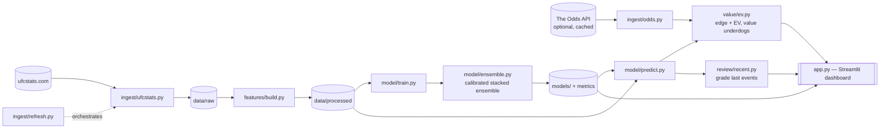
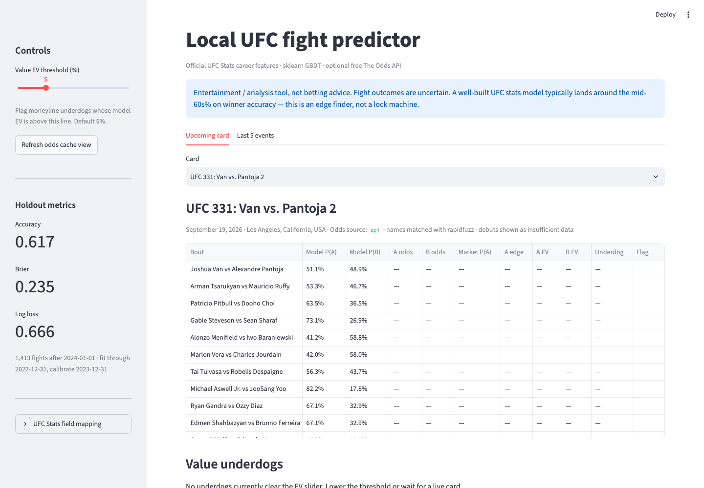
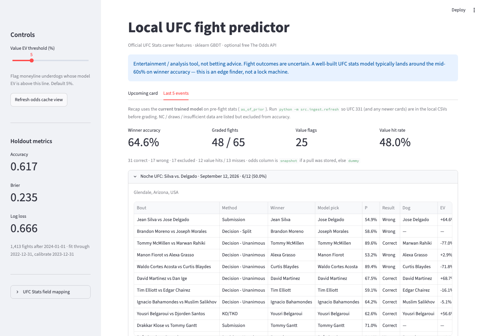

# Local UFC Fight Predictor

Fully local Python app: official [UFC Stats](http://ufcstats.com/) career features, a calibrated scikit-learn **stacked ensemble** win model (a reasonable stats model, but *not* better than the betting market — see below), optional free [The Odds API](https://the-odds-api.com/) moneylines, and a Streamlit dashboard that ranks **value underdogs**.

No OpenAI, no cloud GPU, no paid hosting. The only optional account is a **free** Odds API key (500 credits/month). One cached `regions=us&markets=h2h` pull costs **1 credit**.

This is an **entertainment / analysis** tool, **not betting advice**. Fight outcomes are uncertain. A well-built UFC stats model typically lands around the mid-60s% on winner accuracy — an edge finder, not a lock machine.


## Architecture



More detail: [docs/ARCHITECTURE.md](docs/ARCHITECTURE.md)

## Screenshots

**Upcoming card** — model P(A)/P(B), market odds, edge, and EV per bout:



**Last 5 events** — recap grading the trained model against actual results:



## What the model uses

UFC Stats does not publish “jabs” as a named column. Closest official fields, labeled honestly in the UI:

| Style | UFC Stats fields |
| --- | --- |
| Takedowns | TD landed/attempted, accuracy, opponent TD defense |
| Kicks | Significant strikes to the **leg** |
| Jabs | Significant strikes at **distance** (jab/boxing-volume proxy) |
| Under pressure | Strikes absorbed per minute, strike defense, control time against |
| Attacking | SLpM, control time for, knockdowns, ground strikes |

Plus age, reach, stance, days since last fight, last-3 form, and finish rates. Features are **red−blue differentials of career averages using only prior bouts** (no leakage from the fight being predicted). Debuts / missing UFC history show as **insufficient data**, not a fake pick.

## Setup (Mac)

```bash
python3 -m venv .venv && source .venv/bin/activate
pip install -r requirements.txt
cp .env.example .env   # optional: paste ODDS_API_KEY
python -m src.ingest.ufcstats --bootstrap
python -m src.model.train
streamlit run app.py
```

Then open [http://localhost:8501](http://localhost:8501).

Without an API key the odds client uses dummy cached JSON (and synthesizes moneylines for the current card) so the dashboard still shows model vs market and EV.

## Refresh before a card

```bash
python -m src.ingest.refresh
```

Pulls new completed UFC Stats fights, scrapes the upcoming card, rebuilds leak-free features, and performs **one** Odds API call if the 24h disk cache is cold.

Retrain when you want updated weights:

```bash
python -m src.model.train
```

Holdout protocol: train through 2022, calibrate on 2023, evaluate 2024–now (accuracy, Brier, log loss). `python -m src.model.train --tune` additionally runs a time-series-CV randomized search over the gradient-boosting hyperparameters.

## Machine learning

- **Elo ratings** (`compute_elo`): sequential, leak-free, with faster updates for newer fighters and a bonus for finishes. Also feeds *strength of schedule* (mean past-opponent Elo) and win/loss *streak* features.
- **Corner-symmetric training**: every fight is also seen with corners swapped (differentials negated, label flipped), and predictions average both orientations — so P(A beats B) + P(B beats A) = 1 exactly and there is no red-corner bias.
- **Stacked ensemble**: HistGradientBoosting, logistic regression, extra trees and a small MLP, blended by a logistic meta-learner trained only on time-ordered out-of-fold predictions.
- **Platt calibration** on 2023, then a per-model comparison and permutation feature importance on the 2024+ holdout (saved to `models/metrics.json`, shown in the dashboard sidebar).

### How well does it actually work?

- **Single holdout (2024+):** ≈ 64.5% accuracy / 0.636 log loss. That window turned out to be favourable.
- **Walk-forward 2017–2026** (`python -m src.model.backtest`, 4,787 fights, every prediction out-of-sample): **62.3% [60.9, 63.6]** accuracy, 0.653 log loss, versus 56.7% for always picking the red corner. The ensemble beats each simpler model on log loss with bootstrap CIs that exclude zero, but by small margins (0.004–0.011).
- **Versus the market** (`python -m src.ingest.odds_history && python -m src.model.market`; 4,040 walk-forward fights 2017–2026 with pre-fight moneylines): the de-vigged market wins clearly — **67.2% accuracy / 0.604 log loss vs the model's 62.5% / 0.652** (difference +0.048 [+0.039, +0.056]). A 50/50 blend (0.617) is also worse than the market alone. Betting the "value underdog" rule (EV ≥ 5%) at those prices would have returned **−13.3% ROI [−18.7%, −8.1%]** over 2,571 bets. In other words, the model has no demonstrated edge over the line, and the value flags should be read as "where the model disagrees with the market", not as bets. Historical odds: [ultimate_ufc_dataset](https://github.com/shortlikeafox/ultimate_ufc_dataset) (Apache-2.0).
- **Does adding the line as a feature help?** (`python -m src.model.market_model`; 3,198 fights, 2019–2026, walk-forward) No. Log loss: line 0.6036, line-recalibrated 0.6022, line + stats blend 0.6017, full ensemble with the line as a feature 0.6029, stats only 0.6487. Blend and line-aware model are within noise of the line (blend −0.0018 [−0.0038, +0.0003]); the learned blend gives the stats only ~3–15% of the weight it gives the line. The line-aware value rule returned +3.2% ROI [−8.1%, +14.8%] on 538 bets, i.e. indistinguishable from zero. The live model therefore stays stats-only.
- **Prediction ledger** (`python -m src.ledger`): each upcoming bout is logged to `data/ledger/predictions.jsonl` with its probability and odds *before* the event, frozen once the event day starts, and graded when results arrive. It is committed to git, so it is a verifiable out-of-sample track record. The in-app "Last 5 events" recap, by contrast, is in-sample.

## Tests

```bash
pip install -r requirements-dev.txt
pytest -m "not realdata"   # fast, synthetic data
pytest                      # also runs leakage checks on the real UFC Stats history
```

The suite targets the places where a leak would silently inflate results: Elo and career features use only earlier fights (including a truncation test on the real data), corner-mirroring is exactly antisymmetric, the stacker's meta-learner sees only out-of-fold rows, and the prediction ledger freezes at event day. CI (`.github/workflows/tests.yml`) runs them on every push.

## Layout

```
src/ingest/ufcstats.py   seed CSVs + incremental scrape
src/ingest/odds.py       The Odds API, 24h SQLite cache, dummy JSON
src/ingest/refresh.py    before-card refresh
src/features/build.py    leak-free career features
src/model/ensemble.py    symmetric stacked ensemble + Platt calibration
src/model/train.py       training, holdout comparison, feature importance
src/model/predict.py     upcoming matchup → P(win)
src/value/ev.py          de-vig, EV, underdog filter
app.py                   Streamlit dashboard
```

Seed fight history comes from the maintained [Greco1899/scrape_ufc_stats](https://github.com/Greco1899/scrape_ufc_stats) CSVs, then new event pages are scraped incrementally from UFC Stats.

## Value math

American → decimal, multiplicative de-vig for fair market probability, then:

`EV = P_model * (decimal_odds - 1) - (1 - P_model)`

A fighter is flagged when they are the moneyline **underdog** and EV is above the sidebar slider (default ~5%).

Example: model 42% on a +180 dog → decimal 2.80 → EV ≈ +17.6%.

Name matching between UFC Stats and books uses `rapidfuzz` (e.g. Zhang Weili vs Weili Zhang).

## Deploy to Vercel

The Streamlit app needs a long-running server, so Vercel hosts a **static** site instead (`site/`) and no Python runs there:

- `python -m src.export.site` scores the card and writes `site/data.json` (bouts, odds, EV, recap, model metrics).
- `site/index.html` is the dashboard; it reads `data.json` and recomputes value flags in the browser as you move the EV slider.
- `.github/workflows/refresh-site.yml` runs the refresh → train → export pipeline daily and commits `site/data.json`; Vercel redeploys on that push.

Setup: import the repo in Vercel (`vercel.json` sets the output directory; no build step), and add an `ODDS_API_KEY` repository secret for the Action (one Odds API credit per run). Preview locally with `python3 -m http.server --directory site`.

## Out of scope

- No ChatGPT/Claude at prediction time
- No paid historical odds archive (live/upcoming only on the free key)
- No method-of-victory or prop markets in v1 (winner moneylines only)
