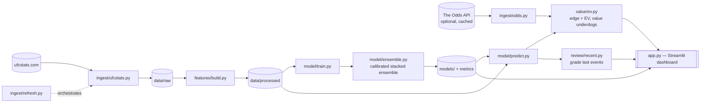

# Architecture

A fully local pipeline: ingest UFC stats → build features → train a stacked ensemble → score upcoming fights → compare with market odds in a Streamlit dashboard.

```mermaid
flowchart LR
    UFC[(ufcstats.com)] --> Ing1[ingest/ufcstats.py]
    Odds[(The Odds API<br/>optional, cached)] --> Ing2[ingest/odds.py]
    Ref[ingest/refresh.py] -.orchestrates.-> Ing1
    Ing1 --> Raw[(data/raw)]
    Raw --> Feat[features/build.py] --> Proc[(data/processed)]
    Proc --> Train[model/train.py]
    Train --> Ens[model/ensemble.py<br/>calibrated stacked ensemble]
    Ens --> Models[(models/ + metrics)]

    Models --> Pred[model/predict.py]
    Proc --> Pred
    Pred --> EV[value/ev.py<br/>edge + EV, value underdogs]
    Ing2 --> EV
    Pred --> Rev[review/recent.py<br/>grade last events]

    EV --> App[["app.py — Streamlit dashboard"]]
    Rev --> App
    Models --> App
```
